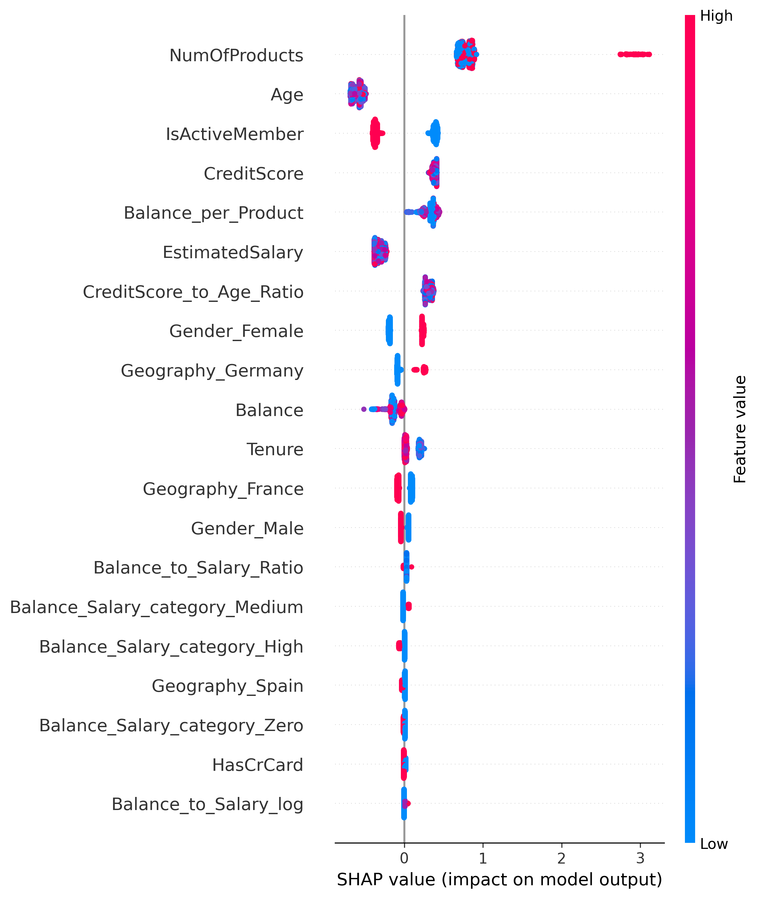
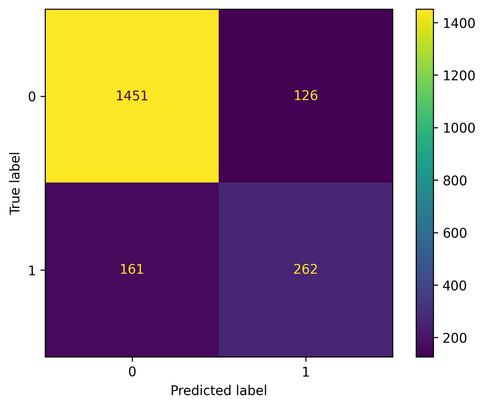

# 🏦 Bank Customer Churn Prediction

This project implements an **end-to-end Machine Learning solution** designed to predict customer attrition in the banking sector. Going beyond simple classification, the primary objective was to build a profit-driven model that identifies high-risk customers while optimizing the trade-off between **Recall** (capturing churners) and **Precision** (minimizing retention costs).

Powered by a hyper-tuned **LightGBM** model and deployed via a **Streamlit** dashboard, this solution provides actionable insights to support proactive retention strategies and budget optimization.

---

## 📌 Key Results & Business Recommendations

After experimenting with multiple algorithms, **LightGBM** was selected as the production model ("Champion Model").

| Metric | Score (Test Set) | Business Interpretation |
| :--- | :--- | :--- |
| **ROC-AUC** | **0.89** | Excellent ability to distinguish between loyal and churning customers. |
| **Recall** | **66%** | The model detects nearly 2/3 of all customers who are actually leaving. |
| **Precision** | **64%** | When the model flags a risk, it is correct 64% of the time (minimizing "spam" and costs). |

## 🔍 Key Drivers of Attrition (Feature Analysis)

Model interpretability analysis (utilizing SHAP values and Feature Importance) identified the following primary determinants of churn:

Product Portfolio Saturation:

- High Risk: Customers holding 3 or 4 products exhibit a drastically elevated probability of attrition.

- Optimal Engagement: Conversely, a holding of exactly 2 products correlates strongly with high retention, suggesting an optimal level of service utilization.

Demographic Risk Factors:

- The 45-60 age cohort demonstrates the highest propensity to exit, indicating a need for tailored value propositions for mid-to-late career individuals.

Member Engagement:

- Dormancy: Inactive status (IsActiveMember = 0) serves as a leading indicator of churn. Active engagement acts as a significant retention buffer.

## 💡 Strategic Recommendation

- Implement a High-Precision Retention Strategy: Resource allocation should prioritize inactive clients aged 45+ holding >2 products.

- Rationale: Leveraging the model's high precision (64%), the bank can deploy high-value intervention tactics (e.g., financial incentives, premium support) with confidence.

- ROI Impact: This targeted approach mitigates the risk of resource misallocation (wasting budget on customers likely to stay) while maximizing the retention of high-value, at-risk accounts.

---

## 📊 Visualizations

### 1. Model Decision Factors (SHAP Values)
The plot below illustrates how specific features impact the probability of churn.



### 2. Model Effectiveness (Confusion Matrix)
The model effectively minimizes false positives, accurately identifying high-risk customers while avoiding unnecessary interventions for loyal clients, thereby making retention campaigns more cost-efficient and maximizing the bank’s overall return on investment.



---

## 🔄 End-to-End ML Pipeline

The project covers the complete ML development cycle:

```powershell
Data → EDA → Preprocessing → Feature Engineering → 
Train/Test Split → SMOTE → Modeling → Evaluation → Explainability
```

```powershell
        ┌────────────┐
        │   Raw Data │
        └─────┬──────┘
              ▼
     ┌───────────────────┐
     │ Exploratory Data  │
     │     Analysis      │
     └─────────┬─────────┘
               ▼
  ┌──────────────────────────┐
  │  Preprocessing & Feature │
  │      Engineering         │
  └────────────┬─────────────┘
               ▼
   ┌────────────────────────┐
   │ Train / Test Split     │
   │  + SMOTE on training   │
   └───────────┬────────────┘
               ▼
     ┌──────────────────────┐
     │   Model Training     │
     │  (Baseline → LGBM)   │
     └──────────┬───────────┘
                ▼
      ┌─────────────────────┐
      │   Evaluation +      │
      │ Model Explainability│
      └─────────────────────┘
```

---

## ⚙️ Methodology & Technical Approach

The project followed a rigorous, iterative Data Science lifecycle designed to maximize business value and model robustness. The process was structured as follows:

1. Deep-Dive Exploratory Data Analysis (EDA)

- Multivariate Analysis: Conducted in-depth analysis to uncover non-linear relationships, identifying the "2-product sweet spot" for customer retention.

- Distribution Diagnostics: Diagnosed significant right-skewness in financial features (Balance, EstimatedSalary) and detected high-risk cohorts among inactive members aged 45-60.

- Outlier Detection: Used IQR method to identify outliers, deciding to retain relevant financial outliers as they represent high-net-worth individuals.

2. Advanced Feature Engineering & Preprocessing

- Domain-Driven Features: Constructed new financial ratios to capture customer purchasing power and genuine engagement, moving beyond raw metrics:

- BalanceSalaryRatio: Identifying customers who treat the bank as their primary savings institution.

- BalancePerProduct: Distinguishing between "phantom" users (many products, low balance) and engaged clients.

- Robust Scaling: Implemented RobustScaler instead of standard scaling to mitigate the impact of significant outliers in financial data without losing information.

- Categorical Encoding: Transitioned from One-Hot Encoding to native categorical support in LightGBM to reduce dimensionality and improve tree-split efficiency.

3. Handling Imbalanced Data (Pipeline Integration)

- SMOTE Implementation: Addressed the severe class imbalance (80:20) using SMOTE (Synthetic Minority Over-sampling Technique).

- Leakage Prevention: Crucially, SMOTE was implemented within an imblearn.pipeline to ensure synthetic samples were generated only during the training phase of cross-validation folds, preserving the integrity of the validation sets.

4. Model Selection & Optimization

Champion-Challenger Framework: Evaluated multiple algorithms to select the best performer:

- Baseline: Logistic Regression (High Recall, low Precision).

- Challenger: Random Forest (Good handling of non-linearities).

- Champion: LightGBM (Superior speed and predictive performance).

Bayesian Optimization (Optuna): Replaced standard Grid Search with Optuna to efficiently explore the hyperparameter space. The optimization objective was set to maximize the F1-Score, prioritizing a balance between precision and recall.

Threshold Tuning: Post-processing optimization involved adjusting the classification decision threshold based on the Precision-Recall curve. This allowed aligning the model's sensitivity with specific business costs, improving the F1-Score beyond default settings.

---

## 🛠️ Tech Stack

* **Python 3.12.11**
* **Libraries:** Pandas, NumPy, Scikit-Learn, LightGBM, Imbalanced-learn (SMOTE), Joblib, Optuna
* **Visualization:** Matplotlib, Seaborn, SHAP

---

## 🚀 How to Run

1.  Clone the repository:
    ```bash
    git clone <repository url>
    ```
2.  Install dependencies:
    ```bash
    pip install -r requirements.txt
    ```
3.  Run the Jupyter Notebook:
    ```bash
    jupyter notebook "Bank Churn Predictions.ipynb"
    ```
---
